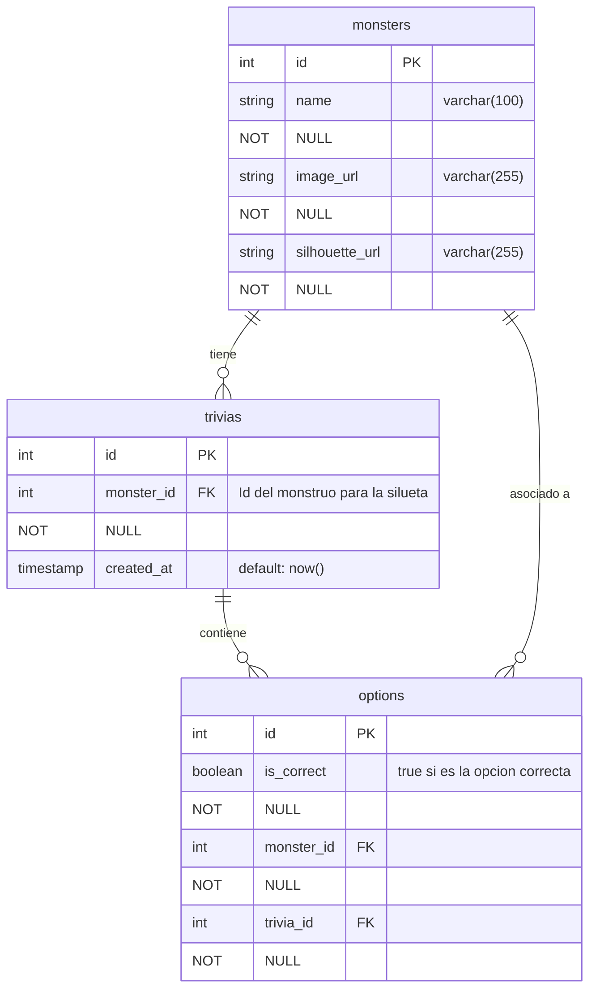

# 🎃 ¿Quién es ese Monstruo? – Backend API

Juego web tipo *"¿Quién es ese Pokémon?"* adaptado a Halloween.  
El backend provee los endpoints para obtener trivias aleatorias, validar respuestas y cargar datos iniciales de monstruos.

---

## 🧠 Descripción General

Este proyecto implementa la **API backend** del juego "¿Quién es ese Monstruo?".  
El objetivo es ofrecer una experiencia divertida y rápida, donde el usuario adivina la identidad de un monstruo a partir de su silueta.

La aplicación sigue una arquitectura REST utilizando **Spring Boot 3.5** y **Java 21**.  
El sistema expone endpoints para:

- Obtener una trivia aleatoria con 4 opciones.
- Validar si la respuesta del usuario es correcta.
- Precargar la base de datos con monstruos mediante un *seed script*.

---

## 🧩 Tecnologías Utilizadas

| Tecnología | Descripción |
|-------------|-------------|
| **Java 21** | Lenguaje base del proyecto |
| **Spring Boot 3.5** | Framework principal para la API REST |
| **Spring Web** | Controladores REST |
| **Spring Data JPA** | Persistencia de datos con PostgreSQL |
| **PostgreSQL** | Base de datos relacional |
| **Lombok** | Reducción de código boilerplate (Getters, Setters, etc.) |
| **MapStruct** | Mapeo entre entidades y DTOs |
| **Swagger UI (Springdoc)** | Documentación interactiva de la API |
| **SLF4J + Logback** | Sistema de logs |

---

## 🧱 Arquitectura del Proyecto

```plaintext
src/
├── main/
│   ├── java/com/halloween/monstertrivia/
│   │   ├── controller/     → Endpoints REST
│   │   ├── service/        → Lógica de negocio
│   │   ├── repository/     → Acceso a datos
│   │   ├── domain/         → Entidades JPA
│   │   ├── dto/            → Objetos de transferencia
│   │   └── config/         → Configuración general
│   └── resources/
│       ├── application.yml → Configuración de entorno
│       └── data/seed.sql   → Datos iniciales (monstruos)
```

---

## 🧩 Diagrama Entidad–Relación (Conceptual)


## 💾 Diagrama de Base de Datos (Modelo Físico)


---

## 🧛 Endpoints Principales

### 🎲 1. Obtener trivia aleatoria

**GET** `/api/trivia`

**Ejemplo de respuesta:**
```json
{
    "id": 3,
    "imagenSilueta": "https://res.cloudinary.com/dfofbqqlg/image/upload/v1761154182/csxosd6c3cooqhtjfyd2.webp",
    "opciones": [
        "Dracula",
        "Bruja",
        "Cthulhu",
        "Diablo"
    ]
}
```

---

### ✅ 2. Validar respuesta

**POST** `/api/validate`

**Body Ejemplo Correcto:**
```json
{
  "id": 3,
  "respuesta": "Diablo"
}
```
**Respuesta:**
```json
{
    "acierto": true,
    "mensaje": "¡Correcto! Era Diablo",
    "imagenReal": "https://res.cloudinary.com/dfofbqqlg/image/upload/v1761154184/ddo0gl9xxk9ul6tzsclq.webp"
}
```
**Body Ejemplo Error:**
```json
{
  "id": 3,
  "respuesta": "Bruja"
}
```
```json
{
    "acierto": false,
    "mensaje": "Fallaste, era Diablo",
    "imagenReal": "https://res.cloudinary.com/dfofbqqlg/image/upload/v1761154184/ddo0gl9xxk9ul6tzsclq.webp"
}
```
---

### 🧬 3. Cargar datos iniciales (Seed)

**Script:** `/resources/data/seed.sql`  
Debe cargar al menos **10 monstruos** con sus respectivas siluetas, nombres y respuestas correctas.

---

## ⚙️ Configuración del Proyecto

### 1️⃣ Clonar repositorio

```bash
git clone https://github.com/tuusuario/monster-trivia-backend.git
cd monster-trivia-backend
```

### 2️⃣ Configurar Base de Datos PostgreSQL

```yaml
spring:
  application:
    name: whos-that-monster

  datasource:
    url: ${DB_URL}
    username: ${DB_USER}
    password: ${DB_PASSWORD}
    driver-class-name: org.postgresql.Driver

  jpa:
    hibernate:
      ddl-auto: create-drop
    show-sql: true
    properties:
      hibernate:
        dialect: org.hibernate.dialect.PostgreSQLDialect
    defer-datasource-initialization: true
```

### 3️⃣ Ejecutar el proyecto

```bash
./mvnw spring-boot:run
```

### 4️⃣ Acceder a Swagger

```bash
http://localhost:8080/swagger-ui.html
```

---

## 📋 Historias de Usuario Implementadas

| ID       | Descripción              | Endpoint             | Estado |
|----------:|--------------------------|----------------------|--------|
| **US01**  | Obtener trivia aleatoria | `GET /api/trivia`    | ✅     |
| **US02**  | Validar respuesta        | `POST /api/validate` | ✅     |
| **US03**  | Cargar seed de monstruos | Script SQL           | ✅     |
| **US08**  | Documentación de Backend | README.MD /docs      | ✅     |

## Diagrama de Capas
```bash
          ┌───────────────────────────────┐
          │         FRONTEND              │
          │ (React / HTML / CSS / JS)     │
          │-------------------------------│
          │ - Muestra silueta del monstruo│
          │ - Presenta 4 opciones         │
          │ - Valida respuesta visualmente│
          │ - Botón siguiente pregunta    │
          └───────────────┬───────────────┘
                          │
                          │  Consume API REST
                          ▼
          ┌───────────────────────────────┐
          │          BACKEND              │
          │       (Spring Boot)           │
          │-------------------------------│
          │ - Endpoint GET /api/trivia    │
          │ - Endpoint POST /api/validate │
          │ - Lógica de validación        │
          │ - Acceso a datos (Repository) │
          └───────────────┬───────────────┘
                          │
                          │  Accede a datos
                          ▼
           ┌───────────────────────────────┐
           │        BASE DE DATOS          │
           │          (PostgreSQL)         │
           │-------------------------------│
           │ Tablas:                       │
           │   • monsters                  │
           │   • trivias                   │
           │   • options                   │
           │-------------------------------│
           │ monsters: id, name, image_url,│
           │             silhouette_url    │
           │ trivias:  id, monster_id,     │
           │           created_at          │
           │ options:  id, is_correct,     │
           │          monster_id, trivia_id│
           └───────────────────────────────┘

```

---
🔹 **Explicación rápida:**
- El **frontend** muestra las trivias, recibe y envía respuestas.
- El **backend** maneja la lógica del juego y comunica con la base de datos.
- La **base de datos** almacena los monstruos y sus datos.  

