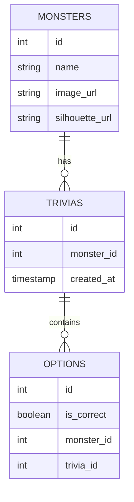
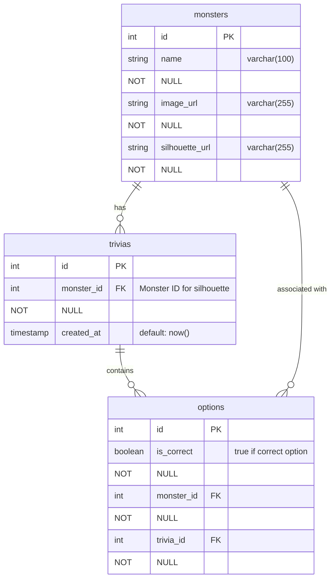

# 🎃 Who’s That Monster? – Backend API

A web game inspired by *“Who’s That Pokémon?”*, adapted for Halloween.  
The backend provides endpoints to fetch random trivia, validate answers, and seed the database with monster data.

---

## 🧠 Overview

This project implements the **backend API** for the game *"Who’s That Monster?"*.  
The goal is to provide a fun and quick experience where users guess the monster’s identity from its silhouette.

The application follows a REST architecture using **Spring Boot 3.5** and **Java 21**.  
The system exposes endpoints to:

- Fetch a random trivia with 4 options.
- Validate whether the user’s answer is correct.
- Preload the database with monsters via a *seed script*.

---

## 🧩 Technologies Used

| Technology | Description |
|------------|-------------|
| **Java 21** | Base programming language |
| **Spring Boot 3.5** | Main framework for REST API |
| **Spring Web** | REST controllers |
| **Spring Data JPA** | Data persistence with PostgreSQL |
| **PostgreSQL** | Relational database |
| **Lombok** | Reduces boilerplate code (Getters, Setters, etc.) |
| **MapStruct** | Mapping between entities and DTOs |
| **Swagger UI (Springdoc)** | Interactive API documentation |
| **SLF4J + Logback** | Logging system |

---

## 🧱 Project Architecture

```plaintext
src/
├── main/
│   ├── java/com/group2/whos_that_monster/
│   │   ├── controller/     → REST endpoints
│   │   ├── dto/            → Data Transfer Objects
│   │   ├── entity/         → JPA entities
│   │   ├── exception/      → Custom exceptions
│   │   ├── mapper/         → MapStruct mappers
│   │   ├── repository/     → Data access layer
│   │   └── service/        → Business logic
│   └── resources/
│       ├── application.yml → Environment configuration
│       └── data.sql        → Initial seed data (monsters)
```

---

## 🧩 Entity–Relationship Diagram (Conceptual)



## 💾 Database Diagram (Physical Model)


---

## 🧛 Main Endpoints

### 🎲 1. Get Random Trivia

**GET** `/api/v1/trivia`

**Sample Response:**
```json
{
    "status": "success",
    "message": "Successful request",
    "data": {
        "id": 10,
        "silhouetteURL": "https://res.cloudinary.com/dfofbqqlg/image/upload/v1761155934/dvstx965u6rjvatjojmm.webp",
        "correctAnswer": 37,
        "options": [
            {
                "id": 39,
                "monsterName": "Frankestein"
            },
            {
                "id": 40,
                "monsterName": "Hombre Lobo"
            },
            {
                "id": 37,
                "monsterName": "Momia"
            },
            {
                "id": 38,
                "monsterName": "Fantasma"
            }
        ]
    }
}
```

---

### ✅ 2. Validate Answer

**POST** `/api/v1/validation`

**Correct Request Example:**
```json
{
    "triviaId" : 10,
    "optionId" : 37
}
```
**Response:**
```json
{
    "status": "success",
    "message": "Validation complete",
    "data": {
        "isCorretBoolean": true,
        "nameMonster": "Momia",
        "monsterImageURL": "https://res.cloudinary.com/dfofbqqlg/image/upload/v1761155936/heayzyub1vd4mgo4enj7.webp"
    }
}
```
**Incorrect Request Example:**
```json
{
    "triviaId" : 10,
    "optionId" : 38
}
```
**Response:**
```json
{
    "status": "success",
    "message": "Validation complete",
    "data": {
        "isCorretBoolean": false,
        "nameMonster": "Momia",
        "monsterImageURL": "https://res.cloudinary.com/dfofbqqlg/image/upload/v1761155936/heayzyub1vd4mgo4enj7.webp"
    }
}
```
---

### 🧬 3. Seed Initial Data

**Script:** `/resources/data.sql`  
Should load at least 10 monsters with their silhouettes, names, and correct answers.

---

## ⚙️ Project Setup

### 1️⃣ Clone Repository

```bash
git clone https://github.com/carloslpz1/whos-that-monster-backend.git
cd whos-that-monster-backend
```

### 2️⃣ Configure PostgreSQL Database

```yaml
spring:
  application:
    name: whos-that-monster

  datasource:
    url: ${DB_URL}
    username: ${DB_USER}
    password: ${DB_PASSWORD}
    driver-class-name: org.postgresql.Driver

  jpa:
    hibernate:
      ddl-auto: create-drop
    show-sql: true
    properties:
      hibernate:
        dialect: org.hibernate.dialect.PostgreSQLDialect
    defer-datasource-initialization: true
```

### 3️⃣ Run the Project

```bash
./mvnw spring-boot:run
```

### 4️⃣ Access Swagger

```bash
/api/v1/swagger-ui/index.html
```

---

## 📋 Implemented User Stories

| ID       | Description            | Endpoint             | Status |
| -------- | ---------------------- | -------------------- | ------ |
| **US01** | Get random trivia      | `GET /api/trivia`    | ✅      |
| **US02** | Validate answer        | `POST /api/validate` | ✅      |
| **US03** | Load monster seed data | SQL Script           | ✅      |
| **US08** | Backend documentation  | README.md /docs      | ✅      |

## Layer Diagram
```bash
          ┌───────────────────────────────┐
          │         FRONTEND              │
          │ (React / HTML / CSS / JS)     │
          │-------------------------------│
          │ - Shows monster silhouette    │
          │ - Displays 4 options          │
          │ - Validates answer visually  │
          │ - Next question button        │
          └───────────────┬───────────────┘
                          │
                          │  Consumes REST API
                          ▼
          ┌───────────────────────────────┐
          │          BACKEND              │
          │       (Spring Boot)           │
          │-------------------------------│
          │ - Endpoint GET /api/trivia    │
          │ - Endpoint POST /api/validate │
          │ - Game validation logic       │
          │ - Data access (Repository)    │
          └───────────────┬───────────────┘
                          │
                          │  Accesses database
                          ▼
           ┌───────────────────────────────┐
           │        DATABASE               │
           │          (PostgreSQL)         │
           │-------------------------------│
           │ Tables:                       │
           │   • monsters                  │
           │   • trivias                   │
           │   • options                   │
           │-------------------------------│
           │ monsters: id, name, image_url,│
           │             silhouette_url    │
           │ trivias:  id, monster_id,     │
           │           created_at,options  │
           │ options:  id, is_correct,     │
           │          monster_id, trivia_id│
           └───────────────────────────────┘


```

---
🔹 **Quick Explanation:**
- The frontend displays trivia, sends user answers, and shows results.
- The backend handles game logic and communicates with the database.
- The database stores monsters and their related data.
